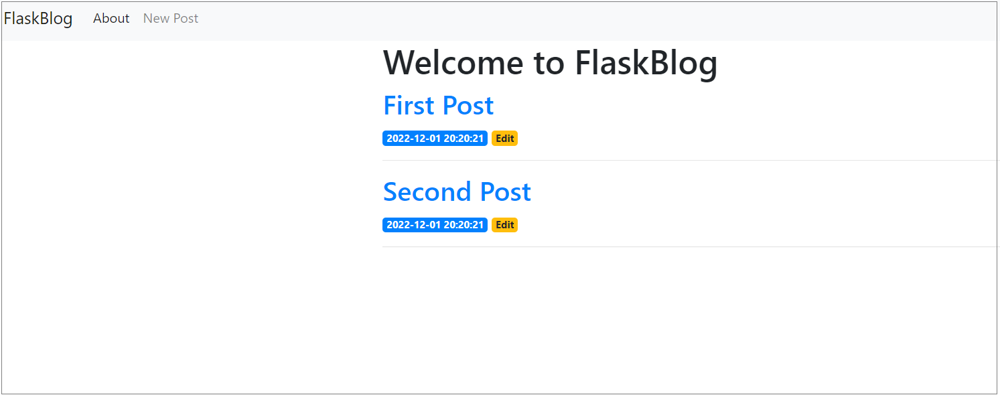

# Веб-блог с помощью flask
Визуальное оформление реализуется с помощью Bootstrap.

На главной странице размещаются все посты с датами. Каждый пост открывается для просмотра по клику на него.

Для постов реализованы CRUD-операции: создание, просмотр, редактирование и удаление.
Посты хранятся в базе данных с использованием SQLite3.



Для запуска нужно в папке проекта:
- создать изолированную среду ```python -m venv env```
- активировать ее ```source env/bin/activate``` на Linux или ```.\env\Scripts\activate``` на Windows
- установить зависимости ```pip install -r requirements.txt```
- запустить приложение ```python app.py```
- перейти в браузере по адресу http://127.0.0.1:5000/


Или через Docker:
- скачать готовый образ ```docker pull dimanik115/flask_blog```
- запустить созданный на основе этого образа контейнер ```docker run -d -p 5000:5000 dimanik115/flask_blog```
- перейти в браузере по адресу http://127.0.0.1:5000/
